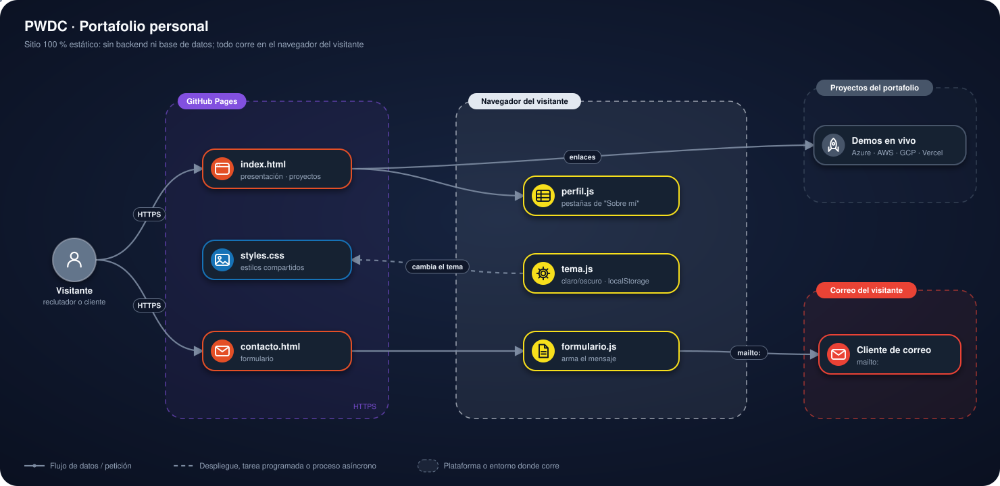

# Portafolio — Luis Felipe Arias

<p>
  <a href="https://lariasca1994.github.io/PWDC/"></a>
</p>


Sitio personal, estático (HTML, CSS y JavaScript puro, sin frameworks ni
backend): presentación profesional, proyectos desplegados del portafolio y
un formulario de contacto real.

### En pocas palabras

- **Qué es:** mi carta de presentación en la web. Cuenta a qué me dedico,
  muestra los proyectos con enlace a sus demos y ofrece un formulario para
  escribirme.
- **Cómo verlo:** entra al [sitio](https://lariasca1994.github.io/PWDC/), o
  descarga el repositorio y abre `index.html` en tu navegador; no necesita
  instalar nada (ver [Cómo verlo](#cómo-verlo)).

## Demo en vivo

**Sitio:** [lariasca1994.github.io/PWDC](https://lariasca1994.github.io/PWDC/)

## Enfoque

El sitio está orientado a los perfiles a los que apunto: QA / Pruebas
funcionales y validación de API REST, Soporte y Gestión de Incidentes (ITIL),
y Análisis y Calidad de Datos. La sección "Sobre mí" está organizada en
pestañas por esos tres perfiles, y cada proyecto listado indica su stack y
enlaza a una demo en vivo cuando está desplegado.

## Arquitectura

<p align="center">
  
</p>

- **GitHub Pages** sirve los archivos estáticos por HTTPS.
- En el **navegador del visitante** corren tres scripts: las pestañas de
  "Sobre mí", el cambio de tema claro/oscuro (recordado en `localStorage`) y el
  formulario de contacto.
- El formulario no envía datos a ningún servidor: arma un enlace `mailto:` y
  abre el **cliente de correo** del visitante.

## Estructura

```
├── index.html          # página principal: presentación, proyectos, habilidades
├── contacto.html        # formulario de contacto
├── CSS/styles.css        # tema claro/oscuro, estilos de todo el sitio
└── JS/
    ├── perfil.js          # pestañas de la sección "Sobre mí"
    ├── tema.js             # alternador de tema claro/oscuro (localStorage)
    └── formulario.js        # arma un mailto: con el mensaje del formulario
```

## A qué se conecta

A nada. No requiere base de datos, backend ni API keys — es un sitio 100%
estático. El formulario de contacto no envía datos a ningún servidor: arma un
enlace `mailto:` con el mensaje y abre el cliente de correo del visitante.

## Cómo verlo

No necesita instalación. Basta con abrir `index.html` en el navegador, o
servirlo en local:

```bash
npm start
```

(usa `npx serve` para levantarlo en `http://localhost:8200`).

Para publicarlo: Settings → Pages → Branch: main → Save, en GitHub. Da una
URL pública en un par de minutos — la que está en uso hoy es
`https://lariasca1994.github.io/PWDC/`.